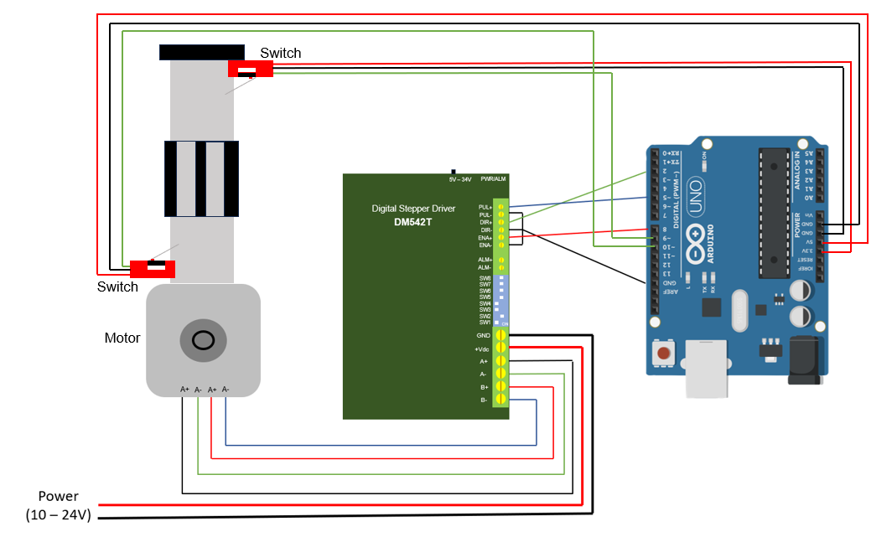
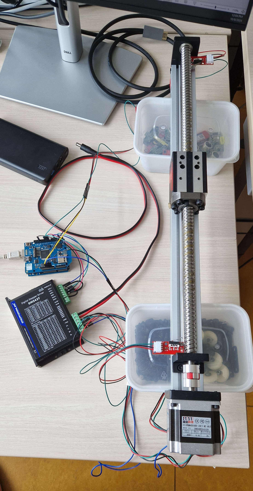

# Railduino Control

The code in this repository allows you to control an Arduino-based linear slide rail with mechanical end-stop switches.

## Getting started

These instructions will get you a copy of the project up and running on your local machine for development and testing purposes in your Arduino.

### Technical details

* [Arduino Uno Rev3](https://store.arduino.cc/products/arduino-uno-rev3?srsltid=AfmBOoqLcizA6T-E6oXTokQgY2Rig-4uHMMGAtsWHA1gKzzQQkP7d7gN)

* [Digital Stepper Driver DM542T](https://www.omc-stepperonline.com/download/DM542T.pdf?srsltid=AfmBOop5KMacyZ2jPFB_56YjrdptJ4Izeovtyt38O-jsQKr1ONNAZUgg)

* [High Precision Ball Screw Linear Motion Guide](https://www.fuyumotion.com/high-precision-ball-screw-linear-motion-guide-product)

* [Mechanical End-Stop Switch](https://reprap.org/wiki/Mechanical_Endstop)

* [Battery Pack NB7102](https://talentcell.com/lithium-ion-battery/24v/nb7102.html)

### Connections

The diagram below illustrates how to connect the components to ensure the project operates correctly.

### Required libraries

* [AccelStepper](https://www.arduino.cc/reference/en/libraries/accelstepper/)

* [AccelStepperWithDistances](https://www.arduino.cc/reference/en/libraries/accelstepperwithdistances/)

### Running

Now you can download and install the project in your Arduino.

First download the .ZIP, extract it in your device.

Open your Arduino IDE and upload the file to your device.

Make sure you have everything properly connected and you are ready to go!

### Files

The code was developed, run and tested in Arduino IDE v.2.3.2

Contained files:

The `railduino_control.ino` file is used to control the motor signals and the switches, which will tell you when to change direction.

Additionally, the `railduino_control_accel.ino` file allows us to set the acceleration and speed parameters with which the motor will move.

### Experimental

In the picture below, we can see what the prototype looks like.

## Author

* **Kiyoshy Nakamura**

## License

This project is licensed under the GNU GPLv3 - see the [LICENSE](LICENSE) file for details.

